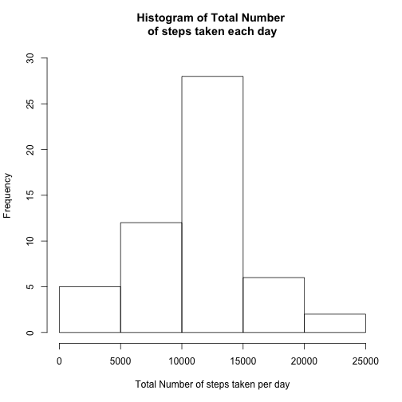
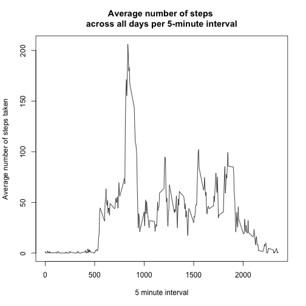
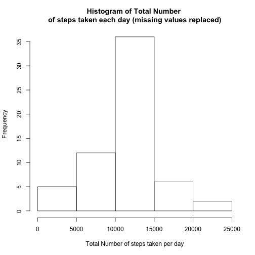
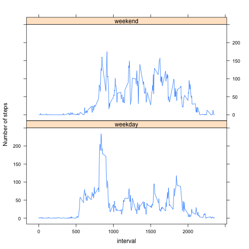

## Loading and Preprocessing the data

We start by loading the data and having a quick look at the dataset.


```r
#Load the data
temp<-tempfile()
fileName<-"https://d396qusza40orc.cloudfront.net/repdata%2Fdata%2Factivity.zip"
download.file(fileName,temp, mode="wb")
#Read the csv file
data <- read.csv(unz(temp, "activity.csv"))
unlink(temp)
#First look at the dataset
dim(data)
```

```
## [1] 17568     3
```

```r
head(data)
```

```
##   steps       date interval
## 1    NA 2012-10-01        0
## 2    NA 2012-10-01        5
## 3    NA 2012-10-01       10
## 4    NA 2012-10-01       15
## 5    NA 2012-10-01       20
## 6    NA 2012-10-01       25
```

## What is mean total number of steps taken per day?

1 - Calculate the total number of steps taken per day

```r
TotalSteps<-aggregate(steps~date, data, FUN="sum")
#Quick look at the results of this calculation:
dim(TotalSteps)
```

```
## [1] 53  2
```

```r
head(TotalSteps)
```

```
##         date steps
## 1 2012-10-02   126
## 2 2012-10-03 11352
## 3 2012-10-04 12116
## 4 2012-10-05 13294
## 5 2012-10-06 15420
## 6 2012-10-07 11015
```

2 - Make a histogram of the total number of steps taken each day

```r
hist(TotalSteps$steps, main = "Histogram of Total Number \nof steps taken each day", xlab = "Total Number of steps taken per day", ylim = c(0,30))
```



 3- Calculate and report the mean and median of the total number of steps taken per day

```r
MeanTotalSteps<-mean(TotalSteps$steps)
MeanTotalSteps
```

```
## [1] 10766.19
```

```r
MedianTotalSteps<-median(TotalSteps$steps)
MedianTotalSteps
```

```
## [1] 10765
```
 The total number of steps taken per day has a mean of 1.0766189 &times; 10<sup>4</sup>, and a median of 10765.
 
## What is the average daily activity pattern?

1 - Make a time series plot (i.e. 𝚝𝚢𝚙𝚎 = "𝚕") of the 5-minute interval (x-axis) and the average number of steps taken, averaged across all days (y-axis)

```r
AvgSteps<-aggregate(steps~interval, data, FUN="mean")
head(AvgSteps)
```

```
##   interval     steps
## 1        0 1.7169811
## 2        5 0.3396226
## 3       10 0.1320755
## 4       15 0.1509434
## 5       20 0.0754717
## 6       25 2.0943396
```

```r
plot(AvgSteps$interval,AvgSteps$steps, type = "l", xlab = "5 minute interval", ylab = "Average number of steps taken", main = "Average number of steps \nacross all days per 5-minute interval")
```



2- Which 5-minute interval, on average across all the days in the dataset, contains the maximum number of steps?


```r
IntervalMaxSteps<-AvgSteps$interval[which.max(AvgSteps$steps)]
IntervalMaxSteps
```

```
## [1] 835
```

```r
MaxSteps<-round(max(AvgSteps$steps), digits = 2)
MaxSteps
```

```
## [1] 206.17
```

The 5-minute interval which, on average across all the days in the dataset, contains the maximum number of steps, is 835. The average number of steps for this interval is 206.17.

## Imputing missing values

1 - Calculate and report the total number of missing values in the dataset (i.e. the total number of rows with 𝙽𝙰s)

```r
CountNA<-nrow(which(is.na(data), arr.ind=TRUE))
CountNA
```

```
## [1] 2304
```

```r
CountNASteps<-length(which(is.na(data$steps), arr.ind=TRUE))
CountNASteps
```

```
## [1] 2304
```
There are 2304 total missing values in the dataset, and they are all located in the "steps" column.

2 - Devise a strategy for filling in all of the missing values in the dataset. 

We choose to replace the missing steps values with the mean for that 5-minute interval.


```r
#Find indexes of rows with missing values.
NASteps<-which(is.na(data$steps), arr.ind=TRUE)
#In the table of average number of steps per interval computed above, find the indexes of the intervals of the missing values.
listIndexes<-match(data$interval[NASteps],AvgSteps$interval)
#For each missing value, find the average number of steps of the corresponding interval. 
filledSteps<-AvgSteps$steps[listIndexes]
```


3 - Create a new dataset that is equal to the original dataset but with the missing data filled in.

```r
#Create new data set identical to data, but where the missing values in the "steps" column have been replaced by the average number of steps for the interval.
dataFilled<-data
dataFilled$steps[NASteps]<-filledSteps
head(dataFilled)
```

```
##       steps       date interval
## 1 1.7169811 2012-10-01        0
## 2 0.3396226 2012-10-01        5
## 3 0.1320755 2012-10-01       10
## 4 0.1509434 2012-10-01       15
## 5 0.0754717 2012-10-01       20
## 6 2.0943396 2012-10-01       25
```

4 - Make a histogram of the total number of steps taken each day and Calculate and report the mean and median total number of steps taken per day. Do these values differ from the estimates from the first part of the assignment? What is the impact of imputing missing data on the estimates of the total daily number of steps?

```r
TotalStepsFilled<-aggregate(steps~date, dataFilled, FUN="sum")
hist(TotalStepsFilled$steps, main = "Histogram of Total Number \nof steps taken each day (missing values replaced)", xlab = "Total Number of steps taken per day")
```



```r
#Calculate mean and median total number of steps taken per day.
MeanTotalStepsFilled<-mean(TotalStepsFilled$steps)
MeanTotalStepsFilled
```

```
## [1] 10766.19
```

```r
MedianTotalStepsFilled<-median(TotalStepsFilled$steps)
MedianTotalStepsFilled
```

```
## [1] 10766.19
```
Imputing missing data did not change the mean total daily number of steps, but it slightly changed the median. This was to be expected based on the method that was chosen for filling in the missing values: the dates with missing steps data now have a total number of steps equal to the average across all days, which would therefore not affect the average.

##Are there differences in activity patterns between weekdays and weekends?
1 - Create a new factor variable in the dataset with two levels – “weekday” and “weekend” indicating whether a given date is a weekday or weekend day.

```r
#We start by identifying the day of the week corresponding to each date.
data$day<-weekdays(as.Date(data$date))
#We then create a column "id" which identifies if the date is a weekday or weekend day.
data$id<-ifelse(data$day == "Saturday" | data$day =="Sunday","weekend","weekday")
head(data)
```

```
##   steps       date interval    day      id
## 1    NA 2012-10-01        0 Monday weekday
## 2    NA 2012-10-01        5 Monday weekday
## 3    NA 2012-10-01       10 Monday weekday
## 4    NA 2012-10-01       15 Monday weekday
## 5    NA 2012-10-01       20 Monday weekday
## 6    NA 2012-10-01       25 Monday weekday
```

2 - Make a panel plot containing a time series plot (i.e. 𝚝𝚢𝚙𝚎 = "𝚕") of the 5-minute interval (x-axis) and the average number of steps taken, averaged across all weekday days or weekend days (y-axis). See the README file in the GitHub repository to see an example of what this plot should look like using simulated data.

```r
AvgStepsDay<-aggregate(steps~interval+id, data, FUN="mean")
with(AvgStepsDay, xyplot(steps~interval|id, type = "l", ylab = "Number of steps", layout = c(1,2)))
```


